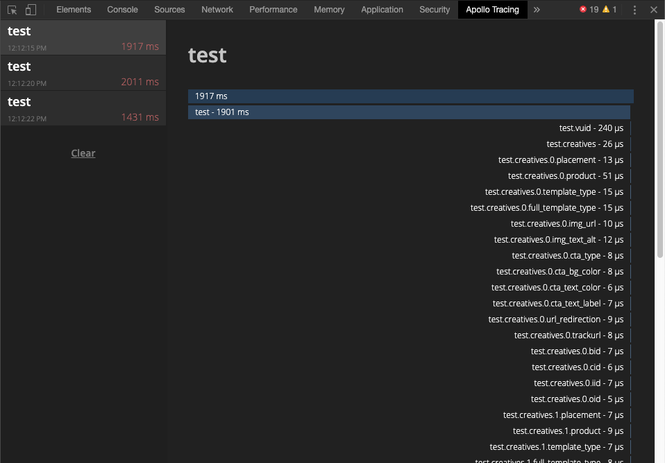

# GraphQL Monitor with Tracing

## How to run

### `npm start`

Runs the app in the development mode. Once the app is running it will update the `dist` on every change.  
Open the [chrome://extensions](chrome://extensions) and click `load unpacked` to add the local extension, once the prompt opens select the `dist` folder.

### `npm run build`

Builds the app for production to the `dist` folder.  
